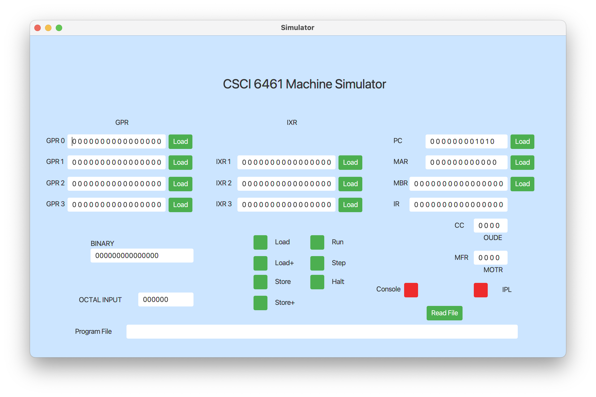
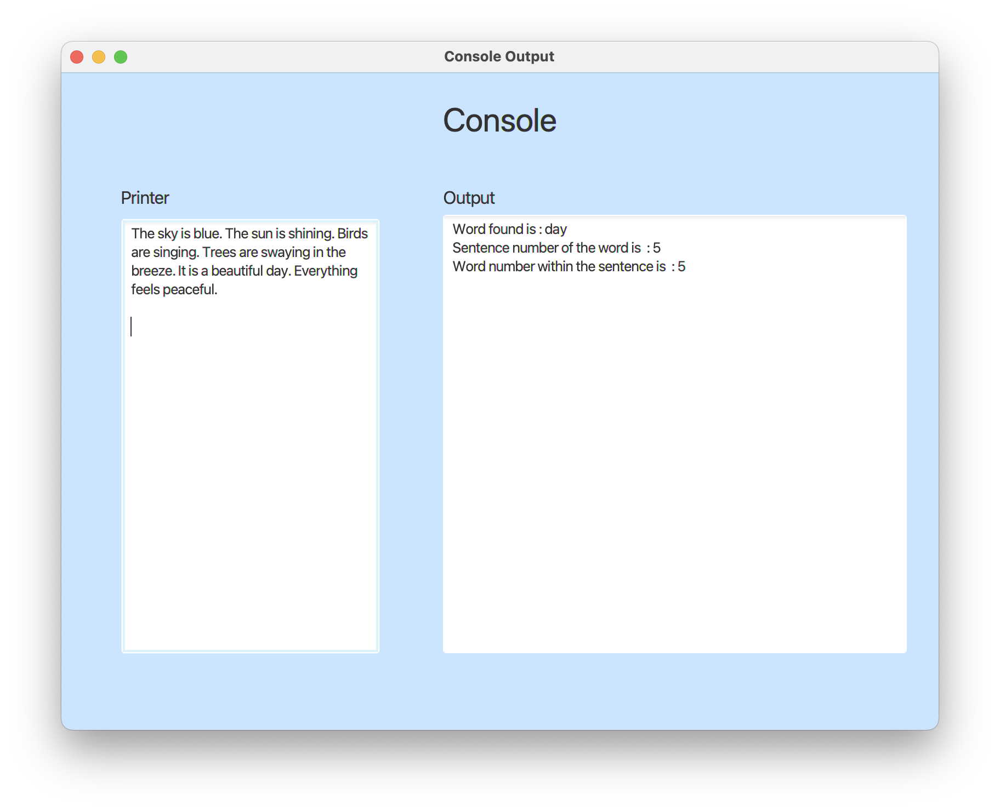

# Computer Architecture Simulator User Manual

## Basic Machine Requirement Analysis

### Project Overview:
Build a project to simulate a computer system. This involves designing and implementing the cache design and implementation.

### Goals:
- Demonstrate functionality of individual instructions.
- Utilize a user interface, such as an operator’s console, for testing instructions.
- Package the simulator as a JAR file, capable of running program 1 and program 2.
- Include a `program2.txt` file containing program 2 as machine code.
- Demonstrate the functionality of Program 2.

## Basic Machine

### Project Objectives:
- Design and implement the basic machine architecture.
- Implement a simple memory system.
- Execute Load and Store instructions.
- Implement caching mechanisms.
- Construct a front panel for input, output, and printer consoles.

### Running the JAR File:
The JAR file can be executed in the following ways:
- **Windows**: Double click the downloaded JAR file `simulator_part3_windows.jar`. Ensure proper permissions are granted.
- **Mac**: Open Terminal and navigate to the desktop using `cd desktop`, then run `java -jar simulator_part3_macos.jar`. Or just double click the JAR file.
- **Linux**: Right-click the file, go to “Properties” then “Permissions”, and check the box “Allow executing file as program”.

Please note that the JAR file requires Java 16 or newer for proper execution.

### GUI (Graphical User Interface):

The simulator's GUI consists of two panels: the main panel and the console panel, along with an input dialog.

#### Main Panel:
The main panel displays the main function of our simulator.

#### Input Dialog:
The input dialog asks for input from the user.

#### Console Panel:
The console panel comprises:
- **Printer TextArea**: Displays the paragraph of 6 sentences.
- **Output TextArea**: Displays the target word, the sentence number, and the word number in the sentence.

### Operation Guidance:
- **IPL**: Click the `IPL` button to initialize the system. It will prompt you to select a file from the local directory.
- **Load Machine Code**: Select the `program2.txt` file from local directories.
- **Read File**: Click the `Read File` button to read the input paragraph of 6 sentences into memory.
- **Load Paragraph**: Select the `paragraph.txt` file from local directories.
- **Input Octal Value**: Input Octal number 62 in `OCTAL INPUT` text field and press enter (62 is the octal address of our first instruction).
- **Load PC**: Press the `Load` button next to the PC text field to load the start address into the program counter.
- **Run**: Click the `Run` button to execute the instructions.
- **Target Input**: Enter one word into the input dialog as instructed.
- **Console**: Click the `Console` button to see the results.
- **Result**: The target word, the sentence number, and the word number in the sentence are printed in the output console. The paragraph is printed in the printer console.
